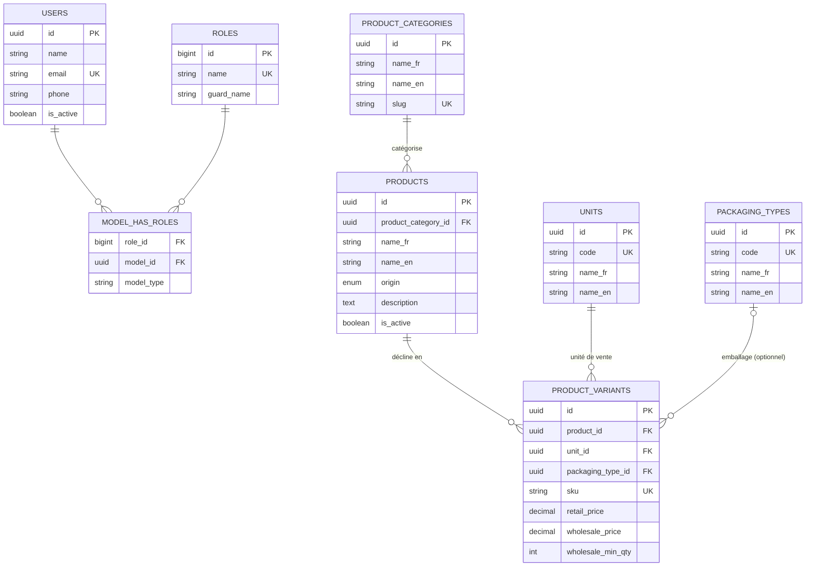

# Kolori — Application de gestion pour magasins de peinture (RDC)

Plan V1 validé le 2026-07-17. Référence transverse pour toute décision technique sur ce projet — à relire avant tout travail substantiel.

## Suivi de l'avancement

**[`tasks.md`](./tasks.md) est la source de vérité de l'avancement du projet** — vue d'ensemble des points du plan, statut de chacun, décomposition en sous-points du point courant, et journal de ce qui a été fait (pages/fonctions créées/modifiées/supprimées) après chaque sous-point exécuté et testé. À consulter en début de session, et à tenir à jour au fur et à mesure (voir workflow §11 ci-dessous).

## Best practices à charger

- Laravel → ~/.claude/best-practices/laravel_best_practices.md
- Vue.js → ~/.claude/best-practices/vuejs_best_practices.md
- Base de données MySQL/PostgreSQL → ~/.claude/best-practices/database_best_practices.md
- Git, sécurité générale, revue de code → ~/.claude/best-practices/git_security_best_practices.md
- Rédaction de prompts (CRAFT/Pull Prompting) → ~/.claude/best-practices/prompt_optimization_best_practices.md

## 1. Objectif

Livrer *Kolori* V1, solide et vendable, en 2-3 semaines. Socle conceptuel vers `painting-erp` (vision 2-3 ans, ~80 tables, ERP complet distribution/vente de peinture) — sans en porter la complexité maintenant. Toute tentation d'ajouter une fonctionnalité "parce que painting-erp l'a" doit être refusée par défaut : voir §5.

## 2. Contraintes non-négociables

- Léger, responsive (mobile-first — device probable en magasin).
- Bilingue FR (défaut)/EN — la langue ne se change QUE depuis la page config (§8), jamais ailleurs dans l'UI.
- Prix affichés simultanément en USD et CDF, taux de change fixé manuellement en config (pas d'API externe en V1).
- PWA avec queue offline côté client : une vente peut être saisie hors-ligne, sync automatique et continue dès reconnexion — jamais bloquant pour l'utilisateur. Le cron serveur 5h/23h est un job de réconciliation/rapport, pas le seul canal de synchronisation.

## 3. Stack technique

Laravel 13 (PHP 8.3) + Inertia + Vue 3 + Tailwind, MySQL 8/MariaDB, Breeze (auth) + Spatie Permission (rôles). PWA à ajouter (service worker + stockage local pour la queue offline).

## 4. Périmètre fonctionnel V1 (IN)

- [x] Rôles (≤5, définis en dur) : `admin`, `vendeur`, `logisticien` (2 slots optionnels si besoin réel apparaît).
- [x] Catalogue produits multi-unités/emballages (kg, sac, litre, bidon, pièce, paquet, rouleau, boîte, carton), prix détail/gros par variante, origine local/importé.
- [ ] Stock simple : quantité courante + mouvements (pas de workflow d'achat formel).
- [ ] Vente/POS : sélection produits, calcul double devise, paiement espèces uniquement (V1), reçu PDF/impression navigateur.
- [ ] Tableau de bord basique : ventes du jour, alertes stock bas.
- [ ] Page config : nom du magasin, logo, couleurs, langue, taux de change, taux de TVA.
- [ ] Multi-magasin : une entreprise, plusieurs magasins (table `stores` + scoping `store_id`).

## 5. Hors scope V1 (explicitement exclu)

Achats fournisseurs, comptabilité/journal comptable, workflow devis→commande→BL→facture, paiement mobile money (Airtel/Orange Money — prévu V2), multi-entrepôt avancé, audit logs complets, séquences documentaires, multi-tenant partagé en base (la revente à d'autres entreprises se fait par redéploiement par client, pas par isolation tenant dans une même base).

## 6. Modèle de données central

Le vrai enjeu métier n'est pas la vente, c'est l'unité de vente flexible par produit (ex : seau vendu à la pièce au détail, au litre en gros). Réutiliser telles quelles les tables `units`, `packaging_types`, `product_categories`, `colors` de `painting-erp` (déjà bien pensées, peu coûteuses). Garder les 27 catégories des notes client comme données de départ, structure pensée pour ajout facile de nouvelles catégories sans changement de code.

## Modèle Logique de Données (MLD)

Mis à jour après chaque migration exécutée (voir règle transverse dans le `CLAUDE.md` global) — reflète l'état réel du schéma, pas une projection future.

`permissions`, `model_has_permissions`, `role_has_permissions` (tables Spatie Permission) existent aussi en base mais ne sont pas détaillées ici — gérées par le package, pas du schéma métier custom.

## 7. Conventions de code (héritées de painting-erp)

- Clés primaires UUID (`HasUuids`, voir `app/Models/BaseModel.php`) — tous les nouveaux modèles domaine étendent `BaseModel`. `User` fait exception (étend `Authenticatable` directement) mais reste UUID.
- Service layer pour la logique métier, contrôleurs fins, Form Requests pour la validation.
- `snake_case` en base, tables au pluriel, soft deletes où pertinent.
- PHP 8.3 : attributs natifs (`#[Fillable]`, `#[Hidden]`) plutôt que propriétés `$fillable`/`$hidden` quand applicable (déjà en place dans `User.php`).
- Tests ciblés sur le flux critique (vente → décrément de stock), pas de couverture exhaustive imposée.

## 8. Personnalisation & multi-magasin

Une codebase, table `stores` + scoping. La revente à d'autres entreprises = redéploiement par client avec sa propre branding via la page config (§4) — ne pas construire d'infrastructure multi-tenant pour ça.

## 9. Hébergement

PlanetHoster ou VPS allemand économique. PWA installable. Cron serveur 5h/23h pour rapports/réconciliation (non bloquant, voir §2).

## 10. Jalons de livraison

- **S1** — [x] Socle (Laravel + Breeze + Spatie Permission + UUID + rôles). [x] Catalogue produits. [ ] Stock.
- **S2** — [ ] Vente/POS, double devise, page config (branding + taux + TVA), queue offline PWA.
- **S3** — [ ] Rapports, reçus PDF, polish responsive, tests du flux critique, déploiement.

## 11. Workflow pour chaque point du plan

Pour toute nouvelle fonctionnalité ou modification sur ce projet, suivre cet ordre à chaque fois, sans sauter d'étape :

1. **Exécuter le code** — le faire tourner réellement (serveur, build, route/flux concerné), pas seulement l'écrire.
2. **Tester le code** — `php artisan test` (+ tests ciblés si ajoutés) doivent passer avant de considérer le point terminé.
3. **Mettre à jour `README.md` et `CLAUDE.md`** — cocher ce qui est fait, ajuster §"État actuel" et les cases à cocher concernées.
4. **Proposer le plan du point suivant** — maximum 5 sous-points si le point suivant est complexe, sinon l'annoncer directement en une phrase. Ne pas exécuter le point suivant sans validation explicite.

## État actuel

Squelette posé et poussé sur GitHub (`gabrielbygas/kolori`) le 2026-07-17 : Laravel 13 + Breeze (Vue/Inertia/Tailwind) + Spatie Permission + UUID sur `users` et les tables de permissions + rôles `admin`/`vendeur`/`logisticien` seedés. Catalogue produits (point 4) terminé le 2026-07-18 : tables + seeder (27 catégories) + modèles + CRUD Inertia/Vue (admin/logisticien) + API Resources + tests.

Détail point par point (statut, sous-points en cours, journal) : voir [`tasks.md`](./tasks.md).
